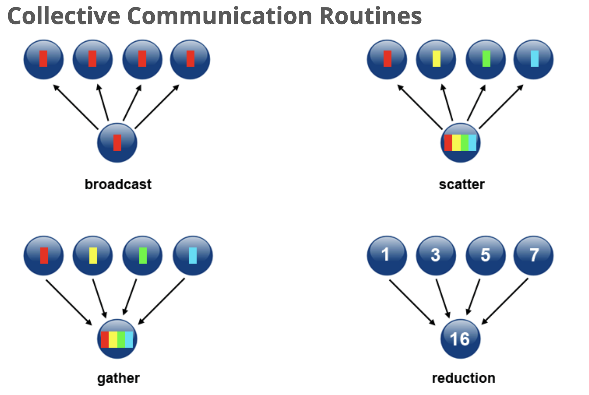

### What is Collective Communication in MPI?

In MPI, **collective communication routines** are operations where **all processes in a group participate** together. They either synchronize, share, or collect data.

### 3 Types of Collective Operations

1. **Synchronization** – All processes wait until everyone reaches the same point.

   * **Example**: `MPI_Barrier()`
2. **Data Movement** – Data is distributed or collected among processes.

   * **Examples**:

     * `MPI_Bcast()` – Broadcast from one to all
     * `MPI_Scatter()` – One sends different parts to all
     * `MPI_Gather()` – All send to one
     * `MPI_Alltoall()` – All send to all
3. **Collective Computation (Reductions)** – Combine data from processes using operations like sum, max, etc.

   * **Examples**:

     * `MPI_Reduce()` – Combine data to one process
     * `MPI_Allreduce()` – Combine data and give result to all
     * `MPI_Scan()` – Prefix sums across processes

### Scope of Collective Operations

* Every process **in the communicator (like `MPI_COMM_WORLD`) must call** the same collective function.
* If **one process skips it**, your program may **hang or crash**.

### Programming Considerations

* **No message tags** in collective functions.
* You can't use custom MPI data types here only predefined ones.
* **Blocking only** in this tutorial (non-blocking is in MPI-3 but skipped here).

## Example

Here’s the **C example** explained in simple terms:

```c
float sendbuf[4][4] = {
  {1.0, 2.0, 3.0, 4.0},
  {5.0, 6.0, 7.0, 8.0},
  {9.0, 10.0, 11.0, 12.0},
  {13.0, 14.0, 15.0, 16.0} 
};
```

### Step-by-step Breakdown:

1. **Processes and Communicator**

   * We have `4` processes in `MPI_COMM_WORLD`.
2. **Source = 1**

   * Process with **rank 1** sends the data.
3. **MPI\_Scatter()**

   * Each process gets **one row** from the 2D array `sendbuf`.
   * For example:

     * Process 0 gets: `{1.0, 2.0, 3.0, 4.0}`
     * Process 1 gets: `{5.0, 6.0, 7.0, 8.0}`
     * Process 2 gets: `{9.0, 10.0, 11.0, 12.0}`
     * Process 3 gets: `{13.0, 14.0, 15.0, 16.0}`

### MPI Functions Used

#### `MPI_Init()`

Starts MPI environment. Must be first MPI call.

#### `MPI_Comm_size()`

Gets number of processes in the communicator.

#### `MPI_Comm_rank()`

Each process gets its unique ID (`rank`) used to identify them.

#### `MPI_Scatter()`

Splits data from one process to all others.

```c
MPI_Scatter(sendbuf, sendcount, sendtype, 
            recvbuf, recvcount, recvtype, 
            root, comm);
```

* `sendbuf`: Full array at root
* `sendcount`: How many elements per process
* `recvbuf`: Where each process stores its portion
* `root`: Who is sending the data (rank 1 here)
* `comm`: Communicator (usually `MPI_COMM_WORLD`)

## Imagine This Visually

Let’s say 4 friends are working together. One of them (rank 1) has a **table with 4 rows of numbers**. He gives **one row to each friend**. That’s `MPI_Scatter`.

## Fortran Example: Same Idea

Key differences:

* Arrays are column-major (it distributes columns unless handled carefully).
* Uses `call MPI_SCATTER(...)` instead of the C style.

## Summary


| Operation       | Description                    | Who gets what?           |
| --------------- | ------------------------------ | ------------------------ |
| `MPI_Barrier`   | Sync point – all wait         | All                      |
| `MPI_Bcast`     | Send same data from one to all | All get same data        |
| `MPI_Scatter`   | Send parts from one to each    | Each gets a unique part  |
| `MPI_Gather`    | Collect parts from each to one | One gets all             |
| `MPI_Allgather` | Everyone gets everything       | All get full result      |
| `MPI_Reduce`    | Reduce data to one (e.g., sum) | One gets result          |
| `MPI_Allreduce` | Reduce and share with all      | All get result           |
| `MPI_Scan`      | Cumulative sum-style operation | Each gets partial result |
