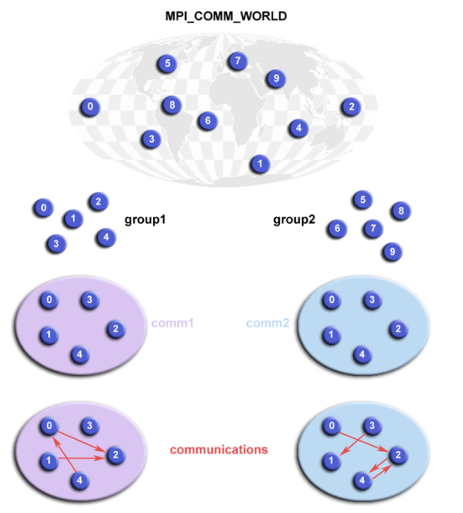

## What's the Big Idea?

When writing **parallel programs using MPI**, sometimes you don’t want **all processes to talk together**. Instead, you might want to:

* Divide processes into **groups**
* Let each group **talk among themselves only**

This is where **Groups** and **Communicators** come in.

## Key Concepts

### 1. **Group**

* A **set of processes** (with specific ranks).
* Groups themselves **cannot be used for communication**.
* Think of it like a *team*.

### 2. **Communicator**

* A tool MPI uses to **actually send messages** between processes.
* Built from a group.
* Each process in a communicator has a **new rank** (starts at 0).

> You already know `MPI_COMM_WORLD`, which includes **all processes**.
> But you can create **your own communicator** to manage a subset.

## Why Use Them?

Imagine you have 8 processes:

```
Ranks: 0 1 2 3 4 5 6 7
```

You want:

* Group 1: 0, 1, 2, 3
* Group 2: 4, 5, 6, 7

Each group will:

* Compute something **separately**
* Communicate **only within itself**

That’s exactly what the example program does.

## C Program Breakdown (Line by Line)

```c
#define NPROCS 8
```

We want exactly **8 processes**.

### Standard Setup

```c
MPI_Init(...);
MPI_Comm_rank(MPI_COMM_WORLD, &rank);
MPI_Comm_size(MPI_COMM_WORLD, &numtasks);
```

Get this process's rank and total number of processes.

### Check for Correct Process Count

```c
if (numtasks != NPROCS) {
    printf("Must specify MP_PROCS= %d. Terminating.\n",NPROCS);
    MPI_Finalize();
    exit(0);
}
```

Stops the program unless you run it with 8 processes.

### Step 1: Get the Global Group

```c
MPI_Comm_group(MPI_COMM_WORLD, &orig_group);
```

Get the group of **all processes** from the default communicator.

### Step 2: Split into Two Groups

```c
if (rank < 4)
    MPI_Group_incl(orig_group, 4, ranks1, &new_group);  // Group 0-3
else
    MPI_Group_incl(orig_group, 4, ranks2, &new_group);  // Group 4-7
```

Create a **new group** using specific ranks (only half the processes in each).

### Step 3: Create a New Communicator

```c
MPI_Comm_create(MPI_COMM_WORLD, new_group, &new_comm);
```

Now you have a **new communicator** that only includes the processes from your group.

> Now, if process 0 sends something using `new_comm`, **only processes 0-3 can receive it.**

### Step 4: Communicate Within the Group

```c
MPI_Allreduce(&sendbuf, &recvbuf, 1, MPI_INT, MPI_SUM, new_comm);
```

Each group adds up all their ranks and **shares the result with everyone in the group**.

### Step 5: Check New Ranks

```c
MPI_Group_rank(new_group, &new_rank);
printf("rank= %d newrank= %d recvbuf= %d\n", rank, new_rank, recvbuf);
```

Each process prints:

* Its original rank (`rank`)
* Its rank in the new group (`newrank`)
* The total result from the group (`recvbuf`)

## Sample Output (Explained)

```
rank= 0 newrank= 0 recvbuf= 6   // Group 0-3: 0+1+2+3 = 6
rank= 1 newrank= 1 recvbuf= 6
rank= 4 newrank= 0 recvbuf= 22  // Group 4-7: 4+5+6+7 = 22
rank= 7 newrank= 3 recvbuf= 22
```

## Summary


| Step | Function          | Description                                |
| ---- | ----------------- | ------------------------------------------ |
| 1    | `MPI_Comm_group`  | Get all-process group from`MPI_COMM_WORLD` |
| 2    | `MPI_Group_incl`  | Create smaller groups from that            |
| 3    | `MPI_Comm_create` | Create communicators from the groups       |
| 4    | `MPI_Allreduce`   | Perform communication**within**new groups  |
| 5    | `MPI_Group_rank`  | Find your**rank in the new group**         |

## Run

Try running it with:

```bash
mpicc -o group group.c
mpirun -np 8 ./group
```
