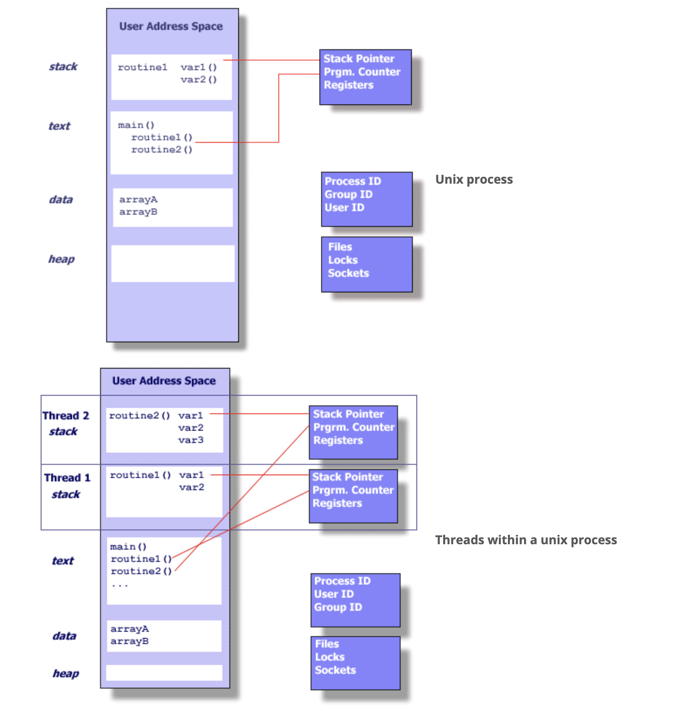
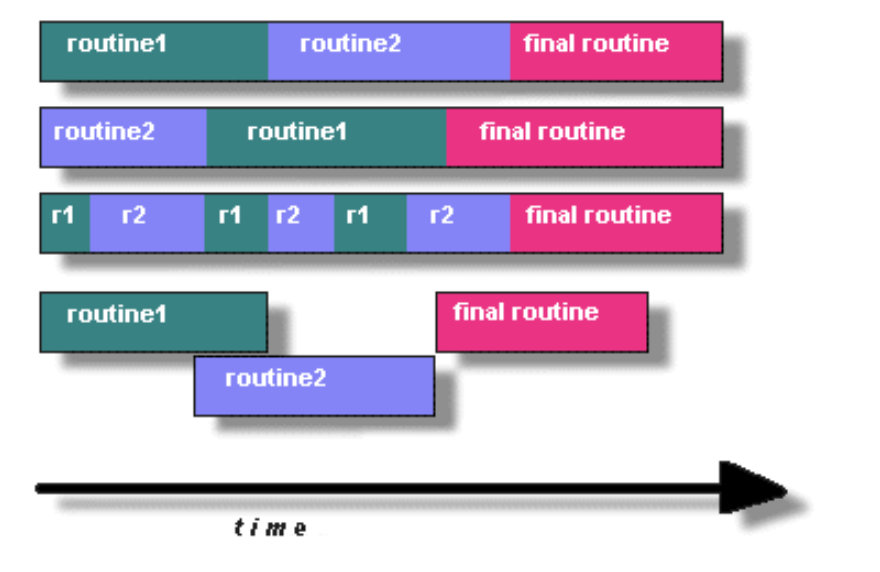
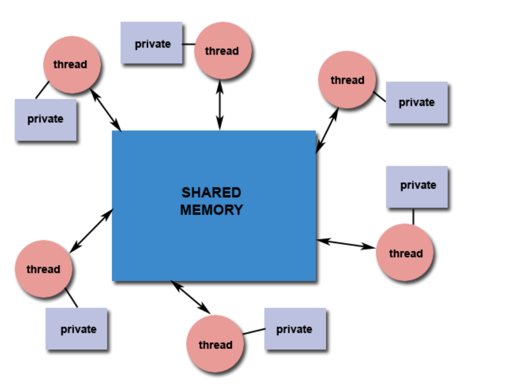
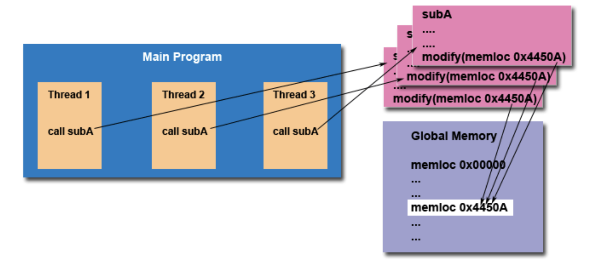

# Parallel programming using POSIX Threads (Pthreads)

## Key Concepts :

### 1. **Shared Memory Multiprocessor Architectures**

* This refers to computer systems where **multiple CPUs share the same memory**.
* These CPUs (or **cores**) can run different parts of a program at the same time — this is called **parallelism**.

### 2. **Threads**

* A **thread** is a "lightweight" process.
* It is the smallest unit of execution in a program.
* In shared memory systems, threads **share the same memory space**.
* Threads are useful for **parallelizing tasks** to run faster.

### 3. **POSIX Threads (Pthreads)**

* POSIX = **Portable Operating System Interface**, a standard defined for Unix systems.
* Pthreads = A **standardized API** (Application Programming Interface) for thread programming in **C**.
* Before POSIX, thread implementations were different for each hardware vendor, making programs **non-portable**.
* POSIX made thread programming **portable and standard**.

## Pthreads API: The 3 Major Parts

1. **Thread Management**
   * Create, run, wait for, and manage threads.
   * E.g., `pthread_create()`, `pthread_join()`
2. **Mutex Variables**
   * **Mutual exclusion locks** to protect shared data from concurrent access.
   * Prevents **race conditions** (when two threads change the same data at the same time).
3. **Condition Variables**
   * Used for **synchronizing threads**.
   * Lets threads **wait** for some condition to become true before continuing.

## What is a Thread?

### Definition:

A **thread** is a small, lightweight unit of a program that can **run independently** within a process.

### Think of It Like This:

Imagine a big machine (a **process**) with multiple arms (**threads**) working on different tasks at the same time. All the arms are part of the same machine, sharing the same workspace and tools (resources like memory, files, etc.).

## Process vs Thread (Key Differences)

| Concept                    | Process                               | Thread                               |
| -------------------------- | ------------------------------------- | ------------------------------------ |
| **Created by**             | Operating system                      | Inside a process                     |
| **Heavy or Light?**        | Heavyweight (uses a lot of resources) | Lightweight (uses minimal resources) |
| **Own memory?**            | Has its own memory space              | Shares memory with other threads     |
| **Can run independently?** | Yes                                   | Yes, but only within the process     |
| **Communication**          | Needs special methods (IPC)           | Easy, through shared memory          |

## What Does a Thread Have?

A thread **doesn't** duplicate everything a process has. It **only keeps what's essential** to run:

* **Stack pointer** – to track function calls
* **Registers** – small, fast memory for operations
* **Scheduling info** – like priority or run order
* **Signals** – messages from the OS or other threads
* **Thread-specific data**

But it **shares** the process's:

* Memory (heap and global variables)
* File descriptors
* Open files
* Environment settings

## Why is That Important?

Because **threads share memory**, you can:

* Easily communicate between threads
* Accidentally overwrite each other’s data

That’s why we need **synchronization tools** (like **mutexes**)

## Summary: UNIX Threads

* A **thread lives inside a process**.
* It is **independently scheduled** by the operating system.
* Threads **share** resources like memory, but each has its own **control flow**.
* This makes threads **fast and efficient** for parallel programming — but you must manage **shared data carefully** to avoid bugs.

# What are Pthreads?

### Pthreads = POSIX Threads

* **"POSIX"** stands for **Portable Operating System Interface** — a set of standards that ensures software works across different UNIX systems.
* **Pthreads** are the **standard way of doing multithreading in C on UNIX-like systems**.

## A Bit of History

### Before POSIX:

* Different hardware vendors (like IBM, HP, Sun) had **their own custom thread libraries**.
* Each one worked differently, so a program written for one system **might not run on another**.

### Then came POSIX (1995):

* A standard interface for threads in **UNIX systems**. ()
* [standards.ieee.org/ieee/1003.1/7101/
* Defined by **IEEE POSIX 1003.1c**.
* Made multithreaded programs **portable and consistent**.
* [standards.ieee.org/ieee/1003.1/7101/](https://standards.ieee.org/ieee/1003.1/7101/)
* [www.opengroup.org/austin/papers/posix\_faq.html](http://www.opengroup.org/austin/papers/posix_faq.html)

Now, most systems support **Pthreads** — even if they still offer their own threading APIs.

## What Does Pthreads Include?

Pthreads is a set of tools for C programmers:

* **Header file**: `pthread.h`
* **Library functions**: A collection of functions for creating and managing threads
* Sometimes part of the main system library (`libc`)

With Pthreads, you can:

* Create threads
* Control thread execution
* Synchronize thread actions using tools like **mutexes** and **condition variables**

## Summary: Why Pthreads Matter

| Problem                                 | POSIX Solution                     |
| --------------------------------------- | ---------------------------------- |
| Different threading APIs on each system | Unified standard (`pthread.h`)     |
| Hard to write portable code             | POSIX makes it work across systems |
| Need for low-level thread control in C  | Pthreads API provides that         |

## Why Use Pthreads?

### 1. **Pthreads Are Lightweight**

* Compared to creating **processes**, creating **threads** uses **much less time and memory**.
* Threads **share memory**, so there's no need to duplicate resources like in processes.

**Example Performance Comparison:**

Creating 50,000 processes using `fork()` took **\~50–100 seconds** on older machines.

Creating 50,000 threads using `pthread_create()` took only **\~1–2 seconds**!

**Threads are 10x–50x faster to create and manage than processes.**

## 2. **Efficient Communication & Data Sharing**

* **Processes** need special communication methods like message passing or shared memory.
* **Threads**, however, can simply **share variables** because they exist in the same memory space.

 **No memory copying needed!**

* Sharing a pointer between threads is enough.
* This avoids memory overhead and speeds up communication.

**Result:** Lower memory usage and **faster inter-thread communication** than MPI within a single node.

### 3. **Great for High Performance Computing (HPC)**

In HPC environments:

* Using threads (like Pthreads) for communication **within a node** is faster than using MPI.
* Some hybrid applications use **MPI for between-node communication** and **Pthreads for within-node parallelism**.

### 4. **Other Practical Advantages**

| Use Case                              | Why Threads Help                                                         |
| ------------------------------------- | ------------------------------------------------------------------------ |
| **Overlap CPU work with I/O**         | One thread waits for I/O, others keep using the CPU                      |
| **Real-time or priority scheduling**  | High-priority tasks can pre-empt lower ones                              |
| **Handling multiple tasks or events** | Threads can handle many things at once (e.g. in web servers or browsers) |
| **Modern software design**            | OS kernels, browsers, servers — all heavily use threads                 |

### Real-World Examples

* **Web Browsers**: Load pages, play videos, and respond to input — all using threads.
* **Operating Systems**: Most parts of modern OSs are multi-threaded (disk management, networking, UI updates).
* **Servers**: Web servers use threads to handle many users at the same time.

## Summary: Why Use Pthreads?

| Feature          | Benefit                                                     |
| ---------------- | ----------------------------------------------------------- |
| Lightweight      | Faster creation and lower overhead than processes           |
| Shared Memory    | No need for data copying, efficient communication           |
| High Performance | Ideal for multi-core systems and hybrid MPI+Threads models  |
| Multitasking     | Useful for I/O overlap, real-time tasks, and event handling |

## Designing Threaded Programs with Pthreads

### 1. **Threading is Parallel Programming**

Threads allow your program to do **multiple things at once**, especially on **multi-core processors**.

To use threads effectively, your problem should be:

* Divided into **independent tasks**
* Able to run parts **concurrently** (at the same time)

## Characteristics of Good Candidates for Threads

Your program is a good fit for threading if it:

✅ Has tasks that:

* **Wait for I/O** (like reading files or data over the network)
* **Use lots of CPU in bursts** (like simulations or calculations)
* **Handle multiple user inputs or events** (e.g. server or GUI)
* **Have mixed importance** (some tasks more urgent than others)

  

### 2. **Common Threading Models**

| Model              | Description                                       | Real-Life Analogy                |
| ------------------ | ------------------------------------------------- | -------------------------------- |
| **Manager/Worker** | One main thread gives tasks to others             | Boss assigns work to employees   |
| **Pipeline**       | Each thread does a step in a sequence             | Car assembly line                |
| **Peer**           | All threads (including main) do parts of the work | A team where everyone pitches in |

### 3. **Shared Memory Model**

In Pthreads:

* **All threads share memory** (global variables, heap).
* But each has **its own stack** (private variables inside functions).

**Danger**: Since threads share memory, they can accidentally overwrite each other’s data.

Programmer's job:

* Carefully **synchronize access** to shared data.
* Prevent **race conditions** (where two threads modify something at the same time).

### 4. **Thread Safety**

**Thread-safe = Safe to use in multithreaded code.**

For example:

* If many threads call the same function and that function modifies shared data **without protection**, you're in trouble.

**If a library function is not thread-safe**, you must:

* Avoid calling it from multiple threads **at the same time**
* Use locks/mutexes to **serialize** those calls

Think: “Only one thread can go in at a time.”

### 5. **Thread Limits & Portability**

Even though Pthreads is a **standard**, real systems behave differently:

| System Difference         | Why It Matters                                                  |
| ------------------------- | --------------------------------------------------------------- |
| Max threads per process   | Some systems may crash or hang if you create too many           |
| Default thread stack size | May cause errors if threads need more stack memory than allowed |

Tip:

* Always check system limits when designing high-thread-count applications.
* Tune thread count and stack size using system settings or program options.

## Summary: Designing with Pthreads

| Key Concept   | Explanation                                               |
| ------------- | --------------------------------------------------------- |
| Concurrency   | Threads let you do multiple things at once                |
| Thread Models | Choose between manager/worker, pipeline, or peer          |
| Shared Memory | Threads share data, but need sync to avoid issues         |
| Thread Safety | Make sure functions/libraries are safe to use in parallel |
| System Limits | Don’t exceed thread count or stack size on your platform |
