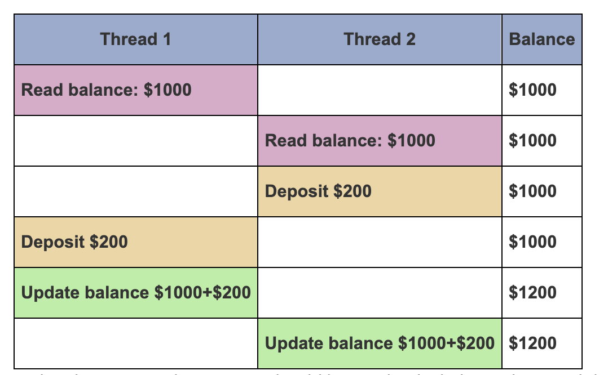

Mutex Variables Overview

## What is a Mutex?

* **Mutex = Mutual Exclusion lock.**
* Protects **shared data** from simultaneous access.
* Only **one thread** can own (lock) the mutex at a time.
* Other threads trying to lock it will **block/wait** until it’s unlocked.

## Why use Mutexes?

They prevent **race conditions**, which occur when multiple threads read and write shared data concurrently, causing inconsistent or corrupted results.

### Example: Bank Account Race Condition




| Thread 1                 | Thread 2                 | Shared Balance |
| ------------------------ | ------------------------ | -------------- |
| Reads balance:\$1000     | Reads balance:\$1000     | \$1000         |
| Deposits\$200            | Deposits\$200            | \$1000         |
| Updates balance to\$1200 | Updates balance to\$1200 | \$1200         |

* Both threads read the same initial balance.
* Both add \$200 independently.
* Both update the balance — but the second update overwrites the first.
* Final balance is wrong (\$1200 instead of \$1400).

## How Mutex Fixes It:

* Thread 1 **locks mutex**, updates balance, unlocks mutex.
* Thread 2 waits until mutex is unlocked, then locks mutex and updates.
* Updates happen **serially** without overlap, ensuring correct final balance.

## Typical Mutex Workflow:

1. Create and initialize a mutex.
2. Threads **lock** the mutex before accessing shared data.
3. Only the thread that locks the mutex can enter critical section.
4. After work, thread **unlocks** the mutex.
5. Other threads can then lock and proceed.
6. When done with mutex, it is **destroyed**.

## Important Notes:

* Mutexes are usually for protecting **global or shared variables**.
* All threads accessing shared data must use the mutex consistently.
* Otherwise, race conditions can still happen if some threads bypass the mutex.
* There are **blocking locks** (`pthread_mutex_lock`) and **non-blocking trylocks** (`pthread_mutex_trylock`).

# Creating and Destroying Mutexes

### Declaring and Initializing Mutexes

Mutex variables are of type `pthread_mutex_t`. They must be initialized **before use**.

#### 1. Static Initialization (at declaration)

```c
pthread_mutex_t mymutex = PTHREAD_MUTEX_INITIALIZER;
```

* Simple and convenient.
* Mutex is initially unlocked.

#### 2. Dynamic Initialization (runtime)

```c
pthread_mutex_t mymutex;
pthread_mutex_init(&mymutex, NULL);
```

* You can pass `pthread_mutexattr_t` attributes instead of `NULL` to customize behavior.
* Mutex is initially unlocked.

### Mutex Attributes (optional)

* `pthread_mutexattr_t` objects define mutex properties.
* Common attributes include:
  * **Protocol:** For preventing priority inversion.
  * **Priority ceiling:** Max priority for the mutex owner.
  * **Process-shared:** Whether mutex can be shared between processes.

To create/destroy attribute objects:

```c
pthread_mutexattr_t attr;
pthread_mutexattr_init(&attr);
/* Set attributes here, if needed */
pthread_mutexattr_destroy(&attr);
```

### Destroying a Mutex

When a mutex is no longer needed:

```c
pthread_mutex_destroy(&mymutex);
```

This frees any resources allocated for the mutex.

# Locking and Unlocking Mutexes

### Key Functions

* **`pthread_mutex_lock(mutex)`**
  Locks the mutex.
  * If the mutex is already locked by another thread, this call **blocks** the caller until the mutex becomes available.
* **`pthread_mutex_trylock(mutex)`**
  Attempts to lock the mutex without blocking.
  * If the mutex is already locked, it returns immediately with an error code (`EBUSY`).
  * Useful to avoid deadlocks or to check lock availability.
* **`pthread_mutex_unlock(mutex)`**
  Unlocks the mutex.
  * Must be called by the thread that currently owns the mutex.
  * Returns an error if the mutex was not locked or owned by another thread.

### Important Notes

* Mutexes depend on **programmer discipline**. Threads must always lock before accessing shared data and unlock afterward.
* Mutexes do **not guarantee fairness**. If multiple threads are waiting, it’s implementation-defined which thread will get the mutex next (usually depends on scheduling).
* Using `trylock` can help avoid deadlocks by failing gracefully if the mutex is busy.

### Example Scenario

```c
// Shared variable
int A = 0;
pthread_mutex_t mutex;

void *thread1_func(void *arg) {
    pthread_mutex_lock(&mutex);
    A = 2;
    pthread_mutex_unlock(&mutex);
    return NULL;
}

void *thread2_func(void *arg) {
    pthread_mutex_lock(&mutex);
    A = A + 1;
    pthread_mutex_unlock(&mutex);
    return NULL;
}

void *thread3_func(void *arg) {
    // No lock here: dangerous!
    A = A * 2;  // Could read/write inconsistent value
    return NULL;
}
```

### Question Recap:

**Which thread gets the mutex first when multiple threads wait for a locked mutex?**

* POSIX does **not guarantee** a strict order for which waiting thread acquires the mutex next. It depends on the OS scheduler and pthread implementation.
