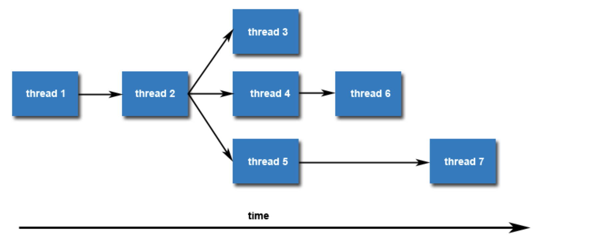
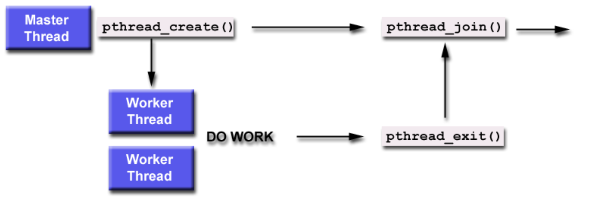

## **Pthreads Thread Management**

### **Creating Threads**

* Use `pthread_create()` to spawn a new thread:

  ```c
  int pthread_create(pthread_t *thread,
                     const pthread_attr_t *attr,
                     void *(*start_routine)(void *),
                     void *arg);
  ```

  **Parameters:**

  * `thread`: Outputs the new thread ID
  * `attr`: Thread attributes (`NULL` = default)
  * `start_routine`: Function the thread will run
  * `arg`: Argument passed to the function (as `void *`)
* Threads run **concurrently** with the main program and other threads.
* Threads are **peers**: no hierarchy, each can create more threads.

### **Thread Limits**

* Systems have limits on how many threads a process can create.
* View and change with `ulimit` (Linux) or `limit` (tcsh/csh):

  ```bash
  ulimit -a            # See current limits
  ulimit -u            # Check max user processes
  ulimit -u 7168       # Set to hard limit (example)
  ```

  

### **Terminating Threads**

#### A thread can terminate by:

1. Returning normally from `start_routine`
2. Calling `pthread_exit(status)`
3. Being canceled by another thread via `pthread_cancel(thread)`
4. Process ending (`exit()` or `exec()`), or `main()` returning

> **Important:** If `main()` ends without calling `pthread_exit()`, all other threads may be forcefully terminated. Always call `pthread_exit(NULL)` at the end of `main()` unless you’re `pthread_join`ing.

### **Cleanup Behavior**

* `pthread_exit()` does **not** close files or release resources opened inside the thread.

### **Simple Thread Example**

```c
#include <pthread.h>
#include <stdio.h>
#include <stdlib.h>

#define NUM_THREADS 5

void *PrintHello(void *threadid) {
   long tid = (long)threadid;
   printf("Hello World! It's me, thread #%ld!\n", tid);
   pthread_exit(NULL);
}

int main() {
   pthread_t threads[NUM_THREADS];
   int rc;
   long t;
   for (t = 0; t < NUM_THREADS; t++) {
      printf("In main: creating thread %ld\n", t);
      rc = pthread_create(&threads[t], NULL, PrintHello, (void *)t);
      if (rc) {
         printf("ERROR; return code from pthread_create() is %d\n", rc);
         exit(-1);
      }
   }

   pthread_exit(NULL); // Keeps main alive until all threads finish
}
```

### **Expected Output (Order May Vary)**

```
In main: creating thread 0
In main: creating thread 1
Hello World! It's me, thread #0!
Hello World! It's me, thread #1!
...
```

# Passing Arguments to Threads

### **Correct Way #1: Pass Value by Casting**

* Use a **separate variable per thread** (e.g., array of `long`):
  ```c
  taskids[t] = t;
  pthread_create(..., PrintHello, (void *)taskids[t]);
  ```
* Inside thread:
  ```c
  long tid = (long)arg;
  ```

✔️ Each thread gets a **unique copy**.

### **Correct Way #2: Use a Struct for Multiple Arguments**

* Define a `struct` with all needed data.
* Use an **array of structs**, one per thread.
  ```c
  struct thread_data {
      int id;
      int sum;
      char *msg;
  };
  ```
* Pass a **pointer** to each thread:
  ```c
  pthread_create(..., PrintHello, (void *)&data_array[t]);
  ```

✔️ This allows passing **multiple values** safely.

### **Incorrect Way: Passing Address of Loop Variable**

```c
pthread_create(..., PrintHello, (void *)&t);
```

Problem: All threads see the **same memory location**; its value may change **before threads read it**, causing **wrong or identical results**.

### **Rule of Thumb:**

> Always pass a **unique memory location** to each thread — either by value or by pointer to a thread-specific structure.

# Joining and Detaching Threads

## **Joining Threads**



* Use `pthread_join(thread, &status)` to:
  * **Wait** for a thread to finish
  * Optionally **get the thread’s return value** via `status`

### Notes:

* Only works if the thread is **joinable**
* A thread can only be joined **once**
* Common use: **main thread waits for all others to finish**

## **Detaching Threads**

* Use `pthread_detach(thread)` to:
  * Let thread **run independently**
  * Its **resources are automatically cleaned** upon termination
* You can also detach **at creation time** using thread attributes

## Thread Attributes (Optional but Recommended)

To set **detach state at creation**:

1. Declare `pthread_attr_t attr;`
2. `pthread_attr_init(&attr);`
3. Set joinable or detached:
   * `PTHREAD_CREATE_JOINABLE` (default in POSIX)
   * `PTHREAD_CREATE_DETACHED`
4. Use in `pthread_create(...)`
5. Destroy after use: `pthread_attr_destroy(&attr);`

## When to Use What?


| Scenario                       | Use                |
| ------------------------------ | ------------------ |
| Need to wait for thread result | `pthread_join()`   |
| Thread runs independently      | `pthread_detach()` |
| Know thread won’t be joined   | Create as detached |

## Common Pitfalls

* Don’t `join` a **detached** thread
* Don’t `join` the **same thread more than once**
* Always `destroy` thread attributes when done

# **Stack Management in Pthreads**

### Why it matters:

* Default stack size varies (from \~98 KB to 32 MB depending on system).
* Heavy stack usage (e.g. large arrays) can easily **overflow** the default limit.
* Stack overflows lead to **crashes** or **data corruption**.

## **Key Routines:**


| Function                                                    | Purpose                                             |
| ----------------------------------------------------------- | --------------------------------------------------- |
| `pthread_attr_getstacksize(&attr, &stacksize)`              | Get current stack size                              |
| `pthread_attr_setstacksize(&attr, size)`                    | Set new stack size (must be ≥ PTHREAD\_STACK\_MIN) |
| `pthread_attr_getstackaddr()`/`pthread_attr_setstackaddr()` | Set/get custom memory address for stack             |

## **Best Practice:**

**Explicitly set the stack size** when creating threads that need large local variables:

```c
pthread_attr_setstacksize(&attr, required_size);
```

You usually calculate it as:

```c
stacksize = sizeof(large_array) + safety_margin;
```

**Note:** A common safety margin is **1 MB extra**.

## Gotchas:

* `pthread_attr_setstacksize()`**must be called before**`pthread_create()`
* Stack size must be a multiple of the system page size
* Don't set it too small — it must be at least `PTHREAD_STACK_MIN`

## Stack Size Examples from LLNL Systems:


| Architecture | Default Stack Size |
| ------------ | ------------------ |
| Intel Xeon   | 2 MB               |
| Intel IA64   | 32 MB              |
| IBM Power5   | 192 KB             |
| IBM Power3   | 96 KB              |

# Miscellaneous Routines

## `pthread_self()`

* Returns the **ID of the calling thread**.
* ID is of type `pthread_t` (opaque).
* Used to identify the current thread (e.g., for debugging or comparison).

## `pthread_equal(thread1, thread2)`

* **Compares two `pthread_t` thread IDs**.
* Returns:
  * `0` → **not equal**
  * Non-zero → **equal**
*  **Do NOT use `==` to compare thread IDs**, because `pthread_t` is **opaque** — its internal representation may vary.

## `pthread_once(once_control, init_routine)`

* Ensures that **`init_routine` is called only once**, even across multiple threads.
* Typically used for **one-time initialization** (e.g., setting up shared resources).
* `once_control` must be **statically initialized** like so:
  ```c
  pthread_once_t once_control = PTHREAD_ONCE_INIT;
  ```

### Use Cases:


| Function          | Use When You Need To...                          |
| ----------------- | ------------------------------------------------ |
| `pthread_self()`  | Identify the thread currently executing          |
| `pthread_equal()` | Safely compare two thread IDs                    |
| `pthread_once()`  | Initialize something once, regardless of threads |
